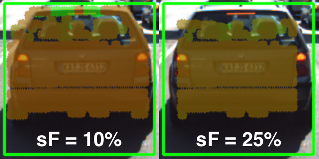

# Creating 3D Objects

First, we separate LiDAR points using already-know regions of interest:


Note that the fourth cluster contains two cars. However, as far
as the camera projection is concerned, all points lie in the same
bounding box. Since the collision avoidance system we are working
on is mostly interested in the closest obstacle, these
faraway points don't matter too much. They could be filtered
out by their distance, or by recognizing them as an entirely
separate cluster from LiDAR only early fusion clustering.

From there, we cluster LiDAR points as objects:


## Grouping Lidar Points Using a Region of Interest
The goal of this section is to group Lidar points that belong to the same physical object in the scene. To do this, we will make use of the camera-based object detection method we investigated in the last section. By using the YOLOv3 framework, we can extract a set of objects from a camera image that are represented by an enclosing rectangle (a "region of interest" or ROI) as well as a class label that identifies the type of object, e.g. a vehicle.

In the following, we will make use of the ROI to associate 3D Lidar points in space with 2D objects in the camera image. As can be seen in the following image, the idea is to project all Lidar points onto the image plane using calibration data and camera view geometry. By cycling through all Lidar points contained in the current data buffer in an outer loop and through all ROI in an inner loop, a test can be performed to check whether a Lidar point belongs to a specific bounding box.


If a Lidar point has been found to be within a ROI, it is added to the BoundingBox data structure we have seen in the previous section on object detection with YOLO. The BoundingBox structure introduced there now contains the following elements:

```cpp
struct BoundingBox { // bounding box around a classified object (contains both 2D and 3D data)

    int boxID; // unique identifier for this bounding box
    int trackID; // unique identifier for the track to which this bounding box belongs

    cv::Rect roi; // 2D region-of-interest in image coordinates
    int classID; // ID based on class file provided to YOLO framework
    double confidence; // classification trust

    std::vector<LidarPoint> lidarPoints; // Lidar 3D points which project into 2D image roi
    std::vector<cv::KeyPoint> keypoints; // keypoints enclosed by 2D roi
    std::vector<cv::DMatch> kptMatches; // keypoint matches enclosed by 2D roi
};
```

During object detection, the members "boxID", "roi", "classID" and "confidence" have been filled with data. During Lidar point grouping in this section, the member "lidarPoints" is filled with all points within the boundaries of the respective ROI rectangle. In terms of the image shown above, this means that all colored Lidar points which have been projected into the camera image are associated with the green rectangle which encloses them. Lidar points not enclosed by a rectangle are ignored.

In some cases, object detection returns ROI that are too large and thus overlap into parts of the scene that are not a part of the enclosed object (e.g. a neighboring vehicle or the road surface). It is therefore advisable to adjust the size of the ROI slightly so that the number of Lidar points which are not physically located on the object is reduced. The following code shows how this can be achieved without much effort.


```cpp
vector<vector<BoundingBox>::iterator> enclosingBoxes; // pointers to all bounding boxes which enclose the current Lidar point
for (vector<BoundingBox>::iterator it2 = boundingBoxes.begin(); it2 != boundingBoxes.end(); ++it2)
{
    // shrink current bounding box slightly to avoid having too many outlier points around the edges
    cv::Rect smallerBox;
    smallerBox.x = (*it2).roi.x + shrinkFactor * (*it2).roi.width / 2.0;
    smallerBox.y = (*it2).roi.y + shrinkFactor * (*it2).roi.height / 2.0;
    smallerBox.width = (*it2).roi.width * (1 - shrinkFactor);
    smallerBox.height = (*it2).roi.height * (1 - shrinkFactor);
```

By providing a factor "shrinkFactor" which denotes the amount of resizing in [% ], a smaller box is created from the original bounding box. Further down in the code (see final project student code for details), a check is performed for each keypoint wether it belongs to the smaller bounding box. The figure below shows two different settings for "shrinkFactor". It can be seen that for second figure, the projected Lidar points are concentrated on the central area of the preceding vehicle whereas Lidar points close to the edges are ignored.



In practice, a moderate setting of 5-10% should be used to avoid discarding too much data. In some cases, when the bounding boxes returned by object detection are severely oversized, this process of boundary frame shrinkage can be an important tool to improve the quality of the associated Lidar point group.

### Exercise: Avoiding Grouping Errors
Another potential problem in addition to oversized regions of interest is their strictly rectangular shape, which rarely fits the physical outline of the enclosed objects. As can be seen in the figure at the very top of this section, the two vehicles in the left lane exhibit a significant overlap in their regions of interest.

During point cloud association, Lidar points located on one vehicle might inadvertently be associated to another other vehicle. In the example illustrated in the figure below, a set of Lidar points in the upper right corner of the green ROI that actually belong to the red truck are associated with the blue vehicle. In the top view perspective on the left, this error becomes clearly visible.


In the code example (see [`cluster_with_roi/`](cluster_with_roi) subdirectory) you will find the algorithm that is responsible for this incorrect behavior.

Your task now is to make changes to this code in such a way that Lidar points enclosed within multiple bounding boxes are excluded from further processing. Visualize your result to ensure that everything works correctly before you proceed to the next section.

You can find the code in the workspace below in cluster_with_roi.cpp, and after making, you can run the code using the executable `cluster_with_roi`.

### Creating 3D Objects
At this stage, we have successfully linked 2D camera data with 3D Lidar points. For (almost) every object in the image, there is now a set of Lidar points belonging to this object which we can easily access in the code.

The aim of this section is to augment our top-view image by displaying information about all bounding boxes (i.e. our 3D objects). In the code sample below, the following properties are extracted from each 3D object:

1. distance to closest point in x-direction
2. object width and height
3. number of supporting Lidar points

As you can see in the resulting top-view image below, Lidar points have been grouped together into several distinct 3D objects.


So by combining Lidar and camera information, an augmented view on the objects in the observed scene can be obtained. However, a computation of the time-to-collision is not yet possible as there is currently no link in time between 3D objects. It will be your task in the upcoming final project to implement this link and to finally compute TTC measurements based on both Lidar and camera.
