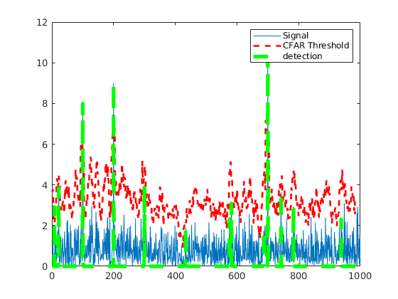

# Cell-Averaging Continuous False Alarm Rate (CA-CFAR)

CA-CFAR is the most commonly used CFAR detection technique. As seen in the previous lesson, the FFT blocks are generated on implementing range and doppler FFTs across the number of chirps. The CFAR process includes the sliding of a window across the cells in FFT blocks. Each window consists of the following cells.

**Cell Under Test:** The cell that is tested to detect the presence of the target by comparing the signal level against the noise estimate (threshold).

**Training Cells:** The level of noise is measured over the Training Cells. The Training Cells can be divided into two regions, the cells lagging the CUT, called lagging Training Cells and the cells leading the CUT, called Leading Training Cells. The noise is estimated by averaging the noise under the training cells. In some cases either leading or lagging cell average is taken, while in the other the leading and lagging cell average is combined and the higher of two is considered for noise level estimate.

The number of training cells should be decided based on the environment. If a dense traffic scenario then the fewer training cells should be used, as closely spaced targets can impact the noise estimate.

**Guard Cells:** The cells just next to CUT are assigned as Guard Cells. The purpose of the Guard Cells is to avoid the target signal from leaking into the training cells that could adversely affect the noise estimate. The number of guard cells should be decided based on the leakage of the target signal out of the cell under test. If target reflections are strong they often get into surrounding bins.

**Threshold Factor (Offset):** Use an offset value to scale the noise threshold. If the signal strength is defined in logarithmic form then add this offset value to the average noise estimate, else multiply it.

## CA-CFAR Exercise

The following steps here can be used to implement CFAR in the next MATLAB exercise. You can use the code template below to get started as well.

**T:** Number of Training Cells

**G:** Number of Guard Cells

**N:** Total number of Cells

1. Define the number of training cells and guard cells
2. Start sliding the window one cell at a time across the complete FFT 1D array. Total window size should be: 2(T+G)+CUT
3. For each step, sum the signal (noise) within all the leading or lagging training cells
4. Average the sum to determine the noise threshold
5. Using an appropriate offset value scale the threshold
6. Now, measure the signal in the CUT, which is T+G+1 from the window starting point
7. Compare the signal measured in 5 against the threshold measured in 4
8. If the level of signal measured in CUT is smaller than the threshold measured, then assign 0 value to the signal within CUT.

See [`CFAR_1D.m`](CFAR_1D.m).

